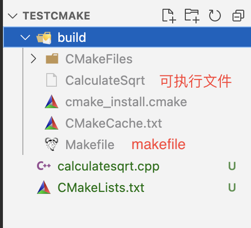
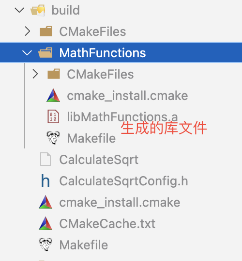

# cmake 生成 makfile
# 1. 简单例子
按照官网教程准备计算平方根的代码，这里命名为 `calculatesqrt.cpp`

```cpp
#include <math.h>
#include <stdio.h>
#include <stdlib.h>

int main(int argc, char* argv[]) {
    if (argc < 2) {
        fprintf(stdout, "Uage: %s number\n", argv[0]);
        return 1;
    }
    double inputValue = atof(argv[1]);
    double outputValue = sqrt(inputValue);
    fprintf(stdout, "The square root of %g is %g\n", inputValue, outputValue);
    return 0;
}
```
编写相应的 CMakeLists.txt 文件

```makefile
cmake_minimum_required(VERSION 3.10) 

# set the project name  项目名称
project(CalculateSqrt) 

# add the executable 将原文件生成为目标文件
add_executable(CalculateSqrt calculatesqrt.cpp) 
```
生成目标文件：

```bash
mkdir build && cd build
cmake ..
make
```


```makefile
 add_executable(<name> [WIN32] [MACOSX_BUNDLE]
                [EXCLUDE_FROM_ALL]
                [source1] [source2 ...])
```
* name: 工程所要构建的目标名称
* WIN32/MACOSX\_BUNDLE: 目标app运行的平台
* source1、source2... : 构建所需的源文件


# 2. 添加一个版本号和配置的头文件
修改 CMakeList.txt 来添加 version number：

```makefile
cmake_minimum_required (VERSION 3.1)
project (CalculateSqrt)
# 版本号.
set (CalculateSqrt_VERSION_MAJOR 1)
set (CalculateSqrt_VERSION_MINOR 0)
# specify the C++ standard 
set(CMAKE_CXX_STANDARD 11) 
set(CMAKE_CXX_STANDARD_REQUIRED True) 
 
# 配置一个头文件来传递一些CMake设置到源代码
# configure_file的作用将一份文件拷贝到另一个位置并修改它的内容，使得在代码中使用CMake中定义的变量 
# configure_file官方文档：https://cmake.org/cmake/help/latest/command/configure_file.html 
configure_file (
  "${PROJECT_SOURCE_DIR}/calculatesqrt.h.in"
  "${PROJECT_BINARY_DIR}/calculatesqrt.h"
)
 
# 添加TutorialConfig.h的路径到头文件的搜索路径
include_directories("${PROJECT_BINARY_DIR}")
 
# 添加目标可执行文件
add_executable(CalculateSqrt calculatesqrt.cpp) 
```
configure\_file 会拷贝一个文件到另一个目录并修改文件内容:

```makefile
configure_file(<input> <output>
               [COPYONLY] [ESCAPE_QUOTES] [@ONLY]
               [NEWLINE_STYLE [UNIX|DOS|WIN32|LF|CRLF] ])
```
cmake会自动定义两个变量

* \${PROJECT\_SOURCE\_DIR}： 当前工程根目录
* \${PROJECT\_BINARY\_DIR}：　当前工程的构建目录（本例中新建的build目录）

在这个例子里，configure\_file 命令的源文件是 CalculateSqrtConfig.h.in，在项目根目录手动创建这个文件：

```makefile
// CalculateSqrtConfig.h.in
// the configured options and settings for CalculateSqrt，@@引用的变量可以通过CMakeLists.txt来设置 
#define CalculateSqrt_VERSION_MAJOR @CalculateSqrt_VERSION_MAJOR@ 
#define CalculateSqrt_VERSION_MINOR @CalculateSqrt_VERSION_MINOR@ 
```
调用CMake的时候会在 build 目录下新的头文件，并且使用 CMakeList.txt 中定义的值来替换 `@CalculateSqrt_VERSION_MAJOR@` 和 `@CalculateSqrt_VERSION_MINOR@` 这两个变量。

> **Major**：主版本号。具有相同名称但不同主版本号的程序集不可互换。例如，这适用于对产品的大量重写，这些重写使得无法实现向后兼容性。

> **Minor**：次版本号。如果两个程序集的名称和主版本号相同，而次版本号不同，这指示显著增强，但照顾到了向后兼容性。例如，这适用于产品的修正版或完全向后兼容的新版本。

下一步要在源文件 calculatesqrt.cpp 中包含这个配置的头文件，就能使用这些版本信息了。

```cpp
#include <math.h>
#include <stdio.h>
#include <stdlib.h>
#include <iostream>

#include "CalculateSqrtConfig.h" 

int main(int argc, char* argv[]) {
    if (argc < 2) {
        std::cout << "Version " <<  CalculateSqrt_VERSION_MAJOR << " " <<  CalculateSqrt_VERSION_MINOR << std::endl;
        fprintf(stdout, "Uage: %s number\n", argv[0]);
        return 1;
    }
    double inputValue = atof(argv[1]);
    double outputValue = sqrt(inputValue);
    fprintf(stdout, "The square root of %g is %g\n", inputValue, outputValue);
    return 0;
}
/* 不输出参数，输出
Version 1 0
Uage: ./CalculateSqrt number*/
```
在 build 目录下执行 `cmake ..` 后就会生成 `CalculateSqrtConfig.h` 文件。


# 3. 为工程添加链接库 lib
在本例中我们为工程添加一个 lib，这个 lib 会包含我们自己实现的平方根计算函数，我们将自己定义的平方根计算函数放置在 MathFunction 目录下，同时在该目录下需要添加一个新的 CMakelists.txt 文件，具体内容如下

```cpp
# 使用特定的源码为项目增加lib 
add_library(MathFunctions mysqrt.cpp) 
```
源文件 mysqrt.cpp 包含一个函数 mysqrt 函数用于计算平方根。代码如下

```cpp
#include <stdio.h>
#include "MathFunctions.h"

// a hack square root calculation using simple operations
double mysqrt(double x) {
    if (x <= 0) {
        return 0;
    }

    double result;
    double delta;
    result = x;

    // do ten iterations
    int i;
    for (i = 0; i < 10; ++i) {
        if (result <= 0) {
            result = 0.1;
        }
        delta = x - (result * result);
        result = result + 0.5 * delta / result;
        fprintf(stdout, "Computing sqrt of %g to be %g\n", x, result);
    }
    return result;
}
```
MathFunctions.h 头文件包含 mysqrt 函数原型：

```cpp
double mysqrt(double x);
```
当前结构目录：

```bash
.
├── CMakeLists.txt
├── CalculateSqrtConfig.h.in
├── MathFunctions
│   ├── CMakeLists.txt      // 新增的 CMakeLists.txt
│   ├── MathFunctions.h
│   └── mysqrt.cpp
├── build
└── calculatesqrt.cpp
```
CMakeLists.txt文件需要相应做如下改动：

* 添加一行 `add_subdirectory` 来保证新加的 library 在工程构建过程中被编译。
* 添加新的头文件搜索路径 `MathFunction/MathFunctions.h`。
* 添加新的 library 到 executable。


```bash
# 略。 上面👆的和之前的一样

# 添加 CalculateSqrtConfig.h 的路径到头文件的搜索路径
# include_directories("${PROJECT_BINARY_DIR}" 
#                     "${PROJECT_SOURCE_DIR}/MathFunctions")


# add the MathFunctions library,Add a subdirectory to the build，将新加的子目录用于build 
add_subdirectory (MathFunctions)

# 添加目标可执行文件
add_executable(CalculateSqrt calculatesqrt.cpp) 
# 该指令的作用为将目标文件与库文件进行链接 
# target_link_libraries官方文档:https://cmake.org/cmake/help/latest/command/target_link_libraries.html 
target_link_libraries(CalculateSqrt MathFunctions)

# 添加 CalculateSqrtConfig.h 的路径到头文件的搜索路径
target_include_directories(CalculateSqrt PUBLIC 
                           "${PROJECT_BINARY_DIR}" 
                           "${PROJECT_SOURCE_DIR}/MathFunctions")
```
> 在这里使用 `include_directories` 还是 `target_include_directories` 都可以。二者差别：

> **include\_directories**：当前 CMakeList.txt 中的所有目标以及所有在其调用点之后添加的子目录中的所有目标将具有此头文件搜索路径。

> **target\_include\_directories**：指定目标包含的头文件路径。

> 如果有不同目录相同名称的头文件会产生影响，所以建议针对特定的 target 进行添加头文件的操作，不要使用include\_directories

执行编译 make，编译日志：

```bash
[ 25%] Building CXX object MathFunctions/CMakeFiles/MathFunctions.dir/mysqrt.cpp.o
[ 50%] Linking CXX static library libMathFunctions.a
[ 50%] Built target MathFunctions
[ 75%] Building CXX object CMakeFiles/CalculateSqrt.dir/calculatesqrt.cpp.o
[100%] Linking CXX executable CalculateSqrt
[100%] Built target CalculateSqrt
```
这里编译生成了新的库 libMathFunctions.a



# 4. 把MathFunctions库配置成可选的
接下来我们尝试将自己定义的 lib 更改为可选的，该功能在本例中不是必要的，但是在大型的项目中却是一个比较常见的功能，具体操作如下。首先就是在上层的 CMakeLists.txt 中增加一个 option，然后将 lib 和 include 路径增加到 EXTRA\_LIBS 和 EXTRA\_INCLUDE 两个变量中，具体根目录的 CMakeLists.txt 修改为如下：

```makefile
cmake_minimum_required (VERSION 3.1)
project (CalculateSqrt)

// USE_MYMATH 选项 默认为 ON
option(USE_MYMATH "Use tutorial provided math implementation" ON) 

# 设置两个版本号变量
set (CalculateSqrt_VERSION_MAJOR 1)
set (CalculateSqrt_VERSION_MINOR 0)
# specify the C++ standard 
set(CMAKE_CXX_STANDARD 11) 
set(CMAKE_CXX_STANDARD_REQUIRED True) 

# 配置一个头文件来传递一些CMake设置到源代码
# configure_file的作用将一份文件拷贝到另一个位置并修改它的内容，使得在代码中使用CMake中定义的变量 
# configure_file官方文档：https://cmake.org/cmake/help/latest/command/configure_file.html 
configure_file (
    "${PROJECT_SOURCE_DIR}/CalculateSqrtConfig.h.in"
    "${PROJECT_BINARY_DIR}/CalculateSqrtConfig.h"
)

# 如果定义了 USE_MYMATH
if(USE_MYMATH) 
    # add the MathFunctions library,Add a subdirectory to the build，将新加的子目录用于build 
    add_subdirectory(MathFunctions) 
    list(APPEND EXTRA_LIBS MathFunctions) 
    # list(APPEND EXTRA_INCLUDES "${PROJECT_SOURCE_DIR}/MathFunctions")
    # 使用 set 命令也可以
    set(EXTRA_INCLUDES ${EXTRA_INCLUDES} "${PROJECT_SOURCE_DIR}/MathFunctions")
endif(USE_MYMATH) 

# 添加目标可执行文件
add_executable(CalculateSqrt calculatesqrt.cpp) 
# 该指令的作用为将目标文件与库文件进行链接 
# target_link_libraries官方文档:https://cmake.org/cmake/help/latest/command/target_link_libraries.html 
target_link_libraries(CalculateSqrt "${EXTRA_LIBS}")

# 添加 CalculateSqrtConfig.h 的路径到头文件的搜索路径
target_include_directories(CalculateSqrt PUBLIC 
                           "${PROJECT_BINARY_DIR}" 
                           "${EXTRA_INCLUDES}")
```
其次需要在可配置的头文件 `CalculateSqrtConfig.h.in` 中添加 CMakeLists.txt 中定义的变量 `USE_MYMATH`

```cpp
// the configured options and settings for CalculateSqrt，@@引用的变量可以通过CMakeLists.txt来设置 
#define CalculateSqrt_VERSION_MAJOR @CalculateSqrt_VERSION_MAJOR@ 
#define CalculateSqrt_VERSION_MINOR @CalculateSqrt_VERSION_MINOR@ 
#cmakedefine USE_MYMATH  // 如果注释这个宏变量，那么就不会编译使用 libMathFunctions 了
```
最后我们在源码中根据 `#ifdef`  判断宏变量 `USE_MYMATH` 是否定义来决定是否 `#include "MathFunctions.h"` 头文件:

```cpp
#include <math.h>
#include <stdio.h>
#include <stdlib.h>
#include <iostream>

#include "CalculateSqrtConfig.h"
#ifdef USE_MYMATH
#include "MathFunctions.h"
#endif

int main(int argc, char* argv[]) {
    if (argc < 2) {
        std::cout << "Version " << CalculateSqrt_VERSION_MAJOR << " "
                  << CalculateSqrt_VERSION_MINOR << std::endl;
        fprintf(stdout, "Uage: %s number\n", argv[0]);
        return 1;
    }
    double inputValue = atof(argv[1]);
#ifdef USE_MYMATH. // 如果定义了就是用 mysqrt
    double outputValue = mysqrt(inputValue);
#else   // 没有定义的话使用 math.h 中的 sqrt 函数
    double outputValue = sqrt(inputValue);
#endif
    fprintf(stdout, "The square root of %g is %g\n", inputValue, outputValue);
    return 0;
}
```


# 5. install 选项（make install）
对于 MathFunctions 库，我们通过在 MathFunctions 的 CMakeList.txt 文件中添加如下两行来安装库和头文件:

```makefile
add_library(MathFunctions mysqrt.cpp)

install(TARGETS MathFunctions DESTINATION bin)
install(FILES MathFunctions.h DESTINATION include)
```
根目录 CMakeList.txt 文件中添加：

```makefile
# add the install targets
install (TARGETS CalculateSqrt DESTINATION bin)
# CalculateSqrt 项目没有 CalculateSqrt.h 所以注释掉
# install (FILES "${PROJECT_BINARY_DIR}/CalculateSqrt.h" DESTINATION include)
```
执行 `cmake ..` 、`make`、 `make install` 后，在编译目录 build 下生成文件 install\_manifest.txt，里面包含了生成的库文件、头文件和目标文件的安装地址（下面是默认安装目录）：

```Plain Text
/usr/local/bin/CalculateSqrt
/usr/local/bin/libMathFunctions.a
/usr/local/include/MathFunctions.h
```
安装目录可以通过 cmake 变量 `CMAKE_INSTALL_PREFIX` 来指定。


# 6. 添加测试用例
在根目录的 CMakeList.txt 文件添加一系列的基础测试来验证应用程序是否正常工作。

```makefile
include(CTest)

# does the application run
add_test (CalculateSqrtRuns CalculateSqrt 25)

# does it sqrt of 25
add_test (CalculateSqrtComp25 CalculateSqrt 25)
set_tests_properties (CalculateSqrtComp25 PROPERTIES PASS_REGULAR_EXPRESSION "25 is 5")

# does it handle negative numbers
add_test (CalculateSqrtNegative CalculateSqrt -25)
set_tests_properties (CalculateSqrtNegative PROPERTIES PASS_REGULAR_EXPRESSION "-25 is 0")

# does it handle small numbers
add_test (CalculateSqrtSmall CalculateSqrt 0.0001)
set_tests_properties (CalculateSqrtSmall PROPERTIES PASS_REGULAR_EXPRESSION "0.0001 is 0.01")

# does the usage message work?
add_test (CalculateSqrtUsage CalculateSqrt)
set_tests_properties (CalculateSqrtUsage PROPERTIES PASS_REGULAR_EXPRESSION "Usage:.*number")
```
编译完成后可以通过在命令行运行 CTest 来执行这些测试用例。如果你希望添加很多测试用例来测试不同的输入值，这个时候推荐你创建一个宏，这样添加新的case会更轻松：

```makefile
include(CTest)
#define a macro to simplify adding tests, then use it
macro (do_test arg result)
  add_test (CalculateSqrt${arg} CalculateSqrt ${arg})
  set_tests_properties (CalculateSqrt${arg}
    PROPERTIES PASS_REGULAR_EXPRESSION ${result})
endmacro (do_test)
 
# do a bunch of result based tests
do_test (25 "25 is 5")
do_test (-25 "-25 is 0")
do_test (0.0001 "0.0001 is 0.01")
```


# 7. 添加系统回顾
下一步我们考虑在工程中添加一些代码，这些代码会依赖的某些特性在运行的目标平台上可能没有。比如说，我们添加了一些代码，这些代码需要用到 log 和 exp 函数，但某些目标平台上可能没有这些库函数。如果平台有 log 函数那么我们就是用 log 来计算平方根，我们首先通过 CheckFunctionExists.cmake 来测试一下是否有这些函数，在根目录的 CMakeList.txt 文件中添加如下内容：

```makefile
# does this system provide the log and exp functions?
include (CheckFunctionExists)
check_function_exists (log HAVE_LOG)
check_function_exists (exp HAVE_EXP)
```
下一步，如果 CMake 发现平台有我们需要的这些函数，则需要修改 CalculateSqrtConfig.h.in 来定义这些值:

```cpp
// does the platform provide exp and log functions?
#cmakedefine HAVE_LOG
#cmakedefine HAVE_EXP
```
有一点很重要，就是 log 和 exp 的测试工作需要在配置 CalculateSqrtConfig.h 前完成（即 `check_function_exists` 等放在 `configure_file` 方法之前）。

最后在 mysqrt 函数中我们可以提供一个可选的实现方式：

```cpp
// if we have both log and exp then use them
#if defined (HAVE_LOG) && defined (HAVE_EXP)
  result = exp(log(x)*0.5);
#else // otherwise use an iterative approach
  . . .
```


# 8. 添加生成文件和生成器 
这一节中我们会演示一下怎么添加一个生成的源文件到引用程序的构建过程中。例如说，我们希望在构建过程中创建一个预先计算好的平方根表，然后把这个表格编译进我们的应用程序。首先我们需要一个能生成这张表的程序。在 MathFunctions 子目录中，定义一个新的源文件 MakeTable.cpp:

```cpp
// A simple program that builds a sqrt table
#include <math.h>
#include <stdio.h>
#include <stdlib.h>

int main(int argc, char *argv[]) {
    int i;
    double result;

    // make sure we have enough arguments
    if (argc < 2) {
        return 1;
    }

    // open the output file
    FILE *fout = fopen(argv[1], "w");
    if (!fout) {
        return 1;
    }

    // create a source file with a table of square roots
    fprintf(fout, "double sqrtTable[] = {\n");
    for (i = 0; i < 10; ++i) {
        result = sqrt(static_cast<double>(i));
        fprintf(fout, "%g,\n", result);
    }

    // close the table with a zero
    fprintf(fout, "0};\n");
    fclose(fout);
    return 0;
}
```
注意到这里的需要传递正确的输出文件给 app，然后才会生成 table。下一步是在 MathFunctions 的 CMakeList.txt 添加相应的命令来编译生成可执行文件 MakeTable，然后在编译过程中运行这个程序。如下所示的添加一些命令：

```makefile
# first we add the executable that generates the table
add_executable(MakeTable MakeTable.cpp)

# add the command to generate the source code
add_custom_command (
    OUTPUT ${CMAKE_CURRENT_BINARY_DIR}/Table.h
    COMMAND MakeTable ${CMAKE_CURRENT_BINARY_DIR}/Table.h
    DEPENDS MakeTable
)

# add the binary tree directory to the search path for 
# include files
include_directories(${CMAKE_CURRENT_BINARY_DIR})

# add the main library
add_library(MathFunctions mysqrt.cpp ${CMAKE_CURRENT_BINARY_DIR}/Table.h)

target_include_directories(MathFunctions
          INTERFACE ${CMAKE_CURRENT_SOURCE_DIR}
          PRIVATE ${CMAKE_CURRENT_BINARY_DIR})
```
* 首先添加可执行的 MakeTable。
* 然后我们添加一个用户命令指定怎么通过允许MakeTable来生成Table.h。
* 下一步需要让 CMAKE 知道 mysqrt.cpp 依赖生成的 Table.h。把生成的 Table.h 添加到 MathFunctions 库的资源列表中。
* 还需要添加当前的 bin 的目录添加到 include 的 list 中，这样 mysqrt.cpp 编译时候可以找到 Table.h。
* 最后编译包含 Table.h 的 mysqrt.cpp 来生成 MathFunctions 库

到这儿最上层的CMakeList.txt文件就如下面所示：

```makefile
cmake_minimum_required (VERSION 3.1)
project (CalculateSqrt)

option(USE_MYMATH "Use tutorial provided math implementation" ON) 

# 设置两个版本号变量
set (CalculateSqrt_VERSION_MAJOR 1)
set (CalculateSqrt_VERSION_MINOR 0)
# specify the C++ standard 
set(CMAKE_CXX_STANDARD 11) 
set(CMAKE_CXX_STANDARD_REQUIRED True) 

# 配置一个头文件来传递一些CMake设置到源代码
# configure_file的作用将一份文件拷贝到另一个位置并修改它的内容，使得在代码中使用CMake中定义的变量 
# configure_file官方文档：https://cmake.org/cmake/help/latest/command/configure_file.html 
configure_file (
    "${PROJECT_SOURCE_DIR}/CalculateSqrtConfig.h.in"
    "${PROJECT_BINARY_DIR}/CalculateSqrtConfig.h"
)

if(USE_MYMATH) 
    # add the MathFunctions library,Add a subdirectory to the build，将新加的子目录用于build 
    add_subdirectory(MathFunctions) 
    list(APPEND EXTRA_LIBS MathFunctions) 
    # list(APPEND EXTRA_INCLUDES "${PROJECT_SOURCE_DIR}/MathFunctions")
    # 使用 set 命令也可以
    set(EXTRA_INCLUDES ${EXTRA_INCLUDES} "${PROJECT_SOURCE_DIR}/MathFunctions")
endif(USE_MYMATH) 

# 添加目标可执行文件
add_executable(CalculateSqrt calculatesqrt.cpp) 
# 该指令的作用为将目标文件与库文件进行链接 
# target_link_libraries官方文档:https://cmake.org/cmake/help/latest/command/target_link_libraries.html 
target_link_libraries(CalculateSqrt "${EXTRA_LIBS}")

# 添加 CalculateSqrtConfig.h 的路径到头文件的搜索路径
target_include_directories(CalculateSqrt PUBLIC 
                           "${PROJECT_BINARY_DIR}" 
                           "${EXTRA_INCLUDES}")

# add the install targets
install (TARGETS CalculateSqrt DESTINATION bin)
# CalculateSqrt 项目没有 CalculateSqrt.h
# install (FILES "${PROJECT_BINARY_DIR}/CalculateSqrt.h" DESTINATION include)


include(CTest)

# # does the application run
# add_test (CalculateSqrtRuns CalculateSqrt 25)

# # does it sqrt of 25
# add_test (CalculateSqrtComp25 CalculateSqrt 25)
# set_tests_properties (CalculateSqrtComp25 PROPERTIES PASS_REGULAR_EXPRESSION "25 is 5")

# # does it handle negative numbers
# add_test (CalculateSqrtNegative CalculateSqrt -25)
# set_tests_properties (CalculateSqrtNegative PROPERTIES PASS_REGULAR_EXPRESSION "-25 is 0")

# # does it handle small numbers
# add_test (CalculateSqrtSmall CalculateSqrt 0.0001)
# set_tests_properties (CalculateSqrtSmall PROPERTIES PASS_REGULAR_EXPRESSION "0.0001 is 0.01")

# # does the usage message work?
# add_test (CalculateSqrtUsage CalculateSqrt)
# set_tests_properties (CalculateSqrtUsage PROPERTIES PASS_REGULAR_EXPRESSION "Usage:.*number")

#define a macro to simplify adding tests, then use it
macro (do_test arg result)
  add_test (CalculateSqrt${arg} CalculateSqrt ${arg})
  set_tests_properties (CalculateSqrt${arg}
    PROPERTIES PASS_REGULAR_EXPRESSION ${result})
endmacro (do_test)
 
# do a bunch of result based tests
do_test (25 "25 is 5")
do_test (-25 "-25 is 0")
do_test (0.0001 "0.0001 is 0.01")
```